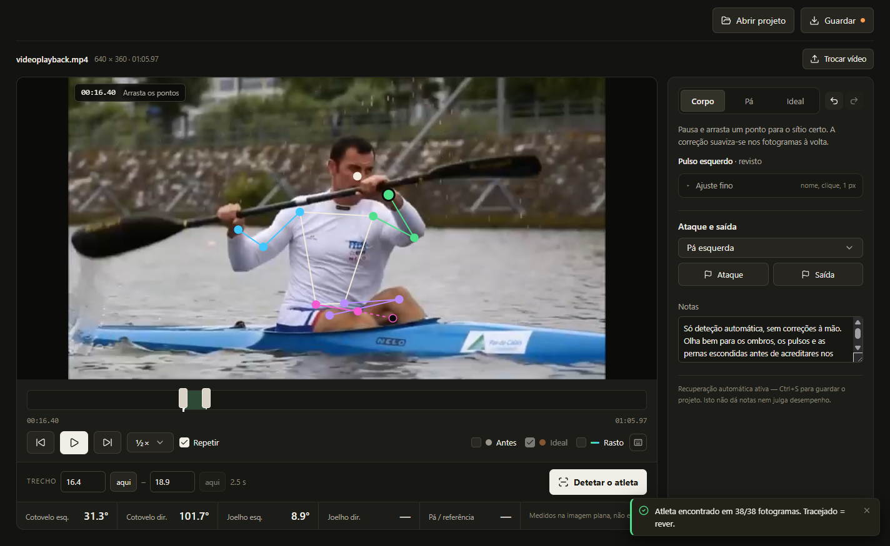
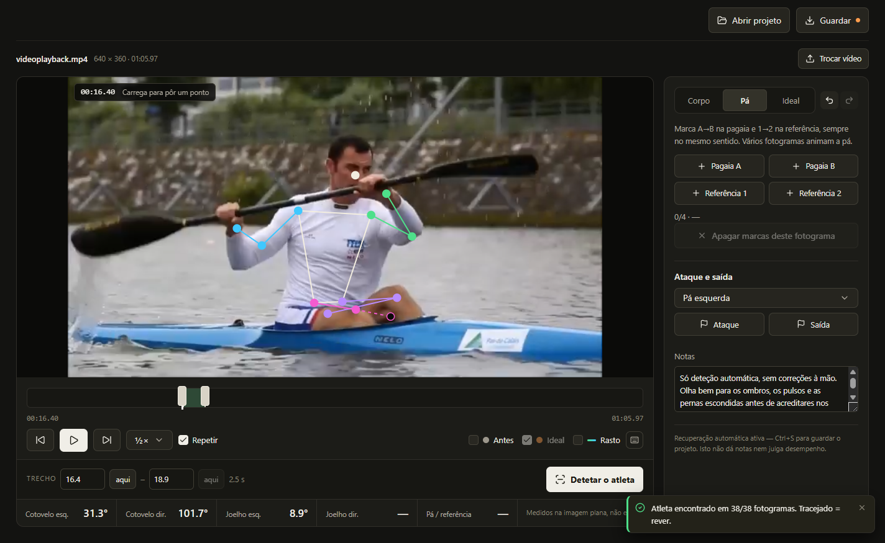

# Stroke

Stroke is a local kayak technique studio for reviewing sprint footage. It tracks an athlete, overlays a pose on the video, and provides tools for correcting joints, annotating the paddle, marking stroke events, and sketching an ideal movement.

The app is currently a **desktop beta (v0.2.0)**, with build targets for Windows x64 and Apple Silicon Macs (M1 and newer). Analysis and project data stay on the computer; no account or cloud upload is required.



## Current features

- Automatic pose tracking with progress and cancellation
- Optional detailed analysis (Heavy model, up to 30 fps)
- Optional fixed athlete region, drawn on the video and saved with the project
- Slow playback, frame stepping, looping, and wrist trails
- Editable joint positions with local interpolation and undo/redo
- Manual paddle and reference-point annotation
- Catch and exit markers for either blade
- 2D elbow, knee, and paddle/reference angles
- An editable ideal-motion overlay for visual comparison
- Portable, versioned `.stroke.json` projects
- Native Windows file dialogs, crash recovery, and remembered video locations



The interface is in European Portuguese. Low-confidence joints use hollow points and dashed bones so uncertain tracking remains visible.

## Install and run

The current release is built for Windows x64:

1. Run `release/Stroke-0.2.0-Windows-x64-Setup.exe`.
2. Install Stroke for the current Windows user.
3. Open **Stroke** from the desktop or Start menu.

The installer does not require administrator access, Python, or Node.js. The unpacked build is also available at `release/win-unpacked/Stroke.exe`; keep that folder together when moving it.

For more detail about the packaged app, diagnostics, recovery, and release builds, see [DESKTOP.md](DESKTOP.md).

GitHub Actions builds and publishes both installers after merges into main. Download them from the [Latest release](https://github.com/DuarteFaria/Stroke/releases/latest). To rebuild manually, open **Actions → Desktop installers → Run workflow** on main. The workflow also runs for relevant pull requests and `v*` tags. macOS users choose `Stroke-macOS-arm64`, open the `.dmg`, and drag Stroke to Applications. These builds have no Apple Developer ID signature or notarization; first launch may require **System Settings → Privacy & Security → Open Anyway**. Intel Macs are not supported by the current analyzer dependency.

## Basic workflow

1. Open a video and select a continuous segment of up to 120 seconds.
2. Choose **Detetar o atleta** to run local pose tracking.
3. Review the segment and drag misplaced joints into position.
4. Use **Pá** to annotate the paddle and reference direction.
5. Mark **Ataque** and **Saída**, or use **Ideal** to sketch a comparison pose.
6. Save the session as a `.stroke.json` project with **Guardar** or `Ctrl+S`.

Project files contain analysis and edits, but not the source video. Keep the original footage alongside the project or reconnect it when prompted.

## Project status

The next development phase is [better 2D detection](docs/DETECTION-PLAN.md), starting
with repeatable coverage reports and manually reviewed reference footage.

Stroke is a functional editor prototype, not validated biomechanics software or an automatic coaching verdict.

Current limits:

- Tracking samples at up to 15 fps for responsive CPU analysis.
- Measurements are 2D image-plane projections, not 3D motion or force estimates.
- Paddle tracking and catch/exit detection are manual.
- Occlusion, crossing limbs, clothing, multiple athletes, and camera cuts can reduce accuracy.
- Video files are limited to 1 GB and analysis segments to 120 seconds.
- The ideal pose is a free 2D sketch; it does not enforce limb lengths or render a new video.
- The Windows installer is currently unsigned, with no automatic updater.

## Development

Requirements for a fresh development machine:

- Windows
- Python 3.12
- Node.js 24
- pnpm 11

Run `Setup-Stroke.ps1` once to install the pinned dependencies and pose model. Codex bundled runtimes are detected automatically when available.

### Browser development

```powershell
./Start-Stroke.ps1
```

This starts the local frontend and analyzer at `http://127.0.0.1:3000`. Use `Stop-Stroke.ps1` to stop them.

### Desktop development

```powershell
./Start-Desktop.ps1
```

### Validation

```powershell
cd app
pnpm build
pnpm typecheck
pnpm lint
pnpm test

cd ..
.venv/Scripts/python.exe -m pytest tests -q
```

The desktop smoke test covers the real renderer, authenticated local API, native project/video handling, decoding and inference, saving, reopening, and recovery. It can optionally refresh the README screenshots by setting `STROKE_SCREENSHOT_DIR` before running the test.

## Repository layout

```text
app/       React and TypeScript editor
backend/   FastAPI and MediaPipe analyzer
desktop/   Electron shell and desktop smoke test
examples/  Sample .stroke.json project
```

The core editor is in `app/app/Studio.tsx`, motion and project logic in `app/lib/motion.ts`, and the local analyzer in `backend/main.py`.

## License

Stroke is licensed under the [MIT License](LICENSE). Third-party dependencies and pose models retain their respective licenses.
